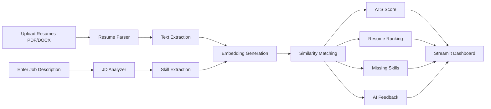

# Smart-Resume-Screener
Smart Resume Screener is an AI-powered application that analyzes and ranks resumes based on job descriptions using NLP and machine learning. It automates candidate screening, provides ATS-style matching scores, identifies key skills, and helps recruiters make faster hiring decisions.

